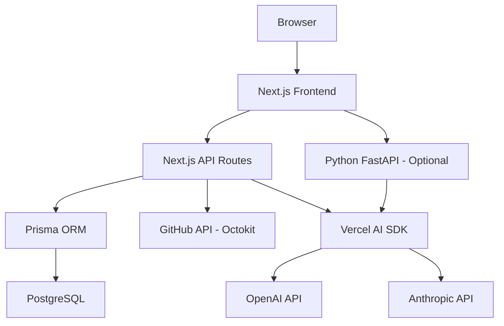
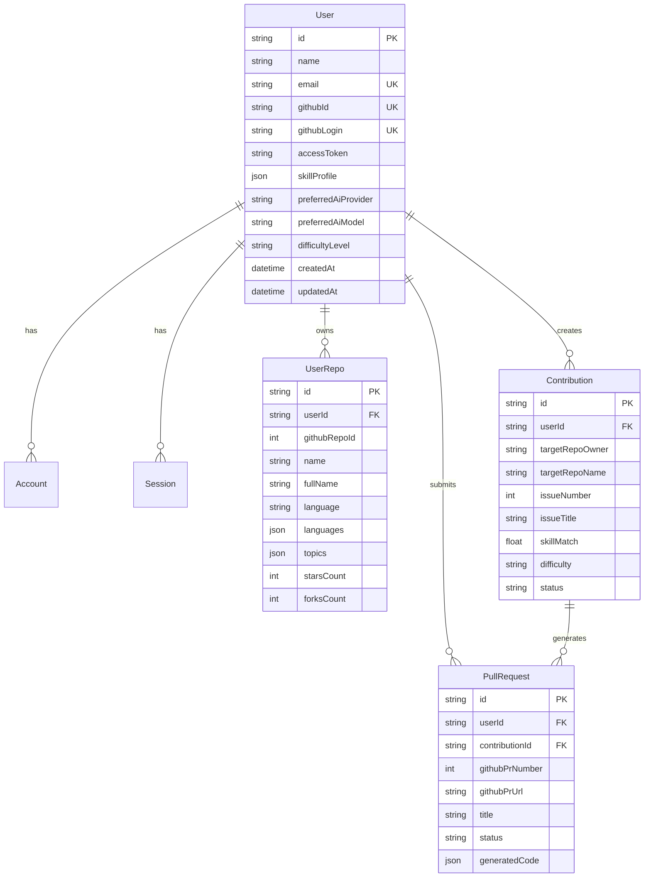

# OSS Contributor — Technical Handover Document

## 1. Executive Summary

**OSS Contributor** is an AI-powered web application that helps developers contribute to open source projects. It analyzes a developer's GitHub profile, identifies their technical strengths, finds matching contribution opportunities across GitHub, and uses AI to generate production-ready code solutions.

**Problem it solves:** Contributing to open source is intimidating for beginners and time-consuming for experienced developers. This tool lowers the barrier by automating discovery and code generation while keeping the developer in control.

**Target users:** Software developers of all skill levels who want to contribute to open source but need help finding合适 issues and generating initial solutions.

**Current production status:** The application builds successfully, has working authentication, database persistence, AI integration, GitHub API integration, and a complete UI. Tests pass. The primary remaining limitation is that it requires real API keys (GitHub OAuth, OpenAI/Anthropic) to function fully.

## 2. Product Overview

### Key Features
- GitHub OAuth authentication
- AI-powered skill profile analysis from repository history
- Open source project discovery via GitHub Search API
- AI code generation for contribution solutions
- Pull request creation workflow
- User settings (AI provider, difficulty level)
- Dashboard with skill visualization

### Primary User Journey
1. User lands on homepage → clicks "Sign in with GitHub"
2. After auth, lands on dashboard → can analyze skills
3. Goes to "Discover" → sees projects matched to their skills
4. Goes to "Contribute" → selects an issue → AI generates code
5. Reviews generated code → submits PR to GitHub

### Roles
- **User** — single role, authenticated via GitHub OAuth

## 3. Architecture Overview



### Data Flow
1. User authenticates via GitHub OAuth → NextAuth.js stores session
2. Frontend calls API routes → API routes verify session
3. API routes interact with GitHub API (repos, issues, PRs)
4. API routes call AI providers for analysis/code generation
5. Results persisted to PostgreSQL via Prisma
6. Python service available for heavier AI tasks (optional)

## 4. Technology Stack

| Technology | Version | Purpose | Why Used |
|-----------|---------|---------|----------|
| Next.js | 14.2.35 | Frontend + API | React framework with App Router, SSR, API routes |
| TypeScript | 5.9.3 | Type safety | Catch errors at compile time |
| Tailwind CSS | 4.x | Styling | Utility-first CSS framework |
| Prisma | 5.22.0 | ORM | Type-safe database access |
| PostgreSQL | - | Database | Relational database for structured data |
| NextAuth.js | 4.24.15 | Authentication | GitHub OAuth integration |
| Vercel AI SDK | 7.0.68 | AI integration | Unified interface for OpenAI/Anthropic |
| Octokit | 22.0.1 | GitHub API | Repository operations, PR creation |
| Zod | 4.4.3 | Validation | Schema validation (available for use) |
| Zustand | 5.0.15 | State management | Available for complex client state |
| Vitest | 4.1.11 | Testing | Unit and integration testing |
| FastAPI | 0.115.0 | Python service | Heavy AI/ML tasks (optional) |

## 5. Repository Structure

```
oss-contributor/
├── src/
│   ├── app/
│   │   ├── (auth)/login/page.tsx          # GitHub login page
│   │   ├── (dashboard)/
│   │   │   ├── layout.tsx                 # Sidebar navigation
│   │   │   ├── dashboard/page.tsx         # Stats + skill map
│   │   │   ├── repos/page.tsx             # Project discovery
│   │   │   ├── contribute/page.tsx        # Contribution workflow
│   │   │   └── settings/page.tsx          # AI provider settings
│   │   ├── api/
│   │   │   ├── analyze/route.ts           # Skill analysis
│   │   │   ├── auth/[...nextauth]/route.ts # NextAuth handler
│   │   │   ├── contribute/route.ts        # Code gen + PR creation
│   │   │   ├── contributions/route.ts     # List contributions
│   │   │   ├── repos/route.ts             # Sync user repos
│   │   │   ├── repos/discover/route.ts    # Find matching repos
│   │   │   └── settings/route.ts          # User preferences
│   │   ├── layout.tsx                     # Root layout
│   │   ├── page.tsx                       # Landing page
│   │   └── globals.css                    # Global styles
│   ├── components/
│   │   ├── ui/button.tsx                  # Button component
│   │   ├── ui/card.tsx                    # Card component
│   │   ├── ui/badge.tsx                   # Badge component
│   │   ├── providers/session-provider.tsx  # NextAuth session provider
│   │   ├── dashboard/skill-map.tsx        # Skill visualization
│   │   ├── dashboard/repo-card.tsx        # Repository card
│   │   └── contribution/contribution-card.tsx # Contribution card
│   └── lib/
│       ├── ai/
│       │   ├── analyze.ts                 # AI analysis functions
│       │   ├── prompts.ts                 # Prompt templates
│       │   ├── providers.ts               # AI provider abstraction
│       │   └── index.ts                   # Barrel export
│       ├── auth/
│       │   ├── config.ts                  # NextAuth configuration
│       │   └── session.ts                 # Session helpers
│       ├── db/index.ts                    # Prisma client
│       ├── github/
│       │   ├── client.ts                  # Octokit client
│       │   ├── repos.ts                   # Repo operations
│       │   ├── pr.ts                      # PR operations
│       │   └── index.ts                   # Barrel export
│       └── utils.ts                       # Utility functions
├── prisma/schema.prisma                   # Database schema
├── python/                                # Optional Python service
├── .github/workflows/ci.yml              # CI/CD configuration
├── vitest.config.ts                       # Test configuration
└── package.json                           # Dependencies and scripts
```

## 6. Application Flow

### Authentication Flow
```
User → /login → signIn("github") → GitHub OAuth
  → Callback → NextAuth stores session + tokens
  → Redirect to /dashboard
```

### Skill Analysis Flow
```
/dashboard → "Analyze My Skills" → POST /api/analyze
  → Fetch user repos from DB → Build prompt
  → Call AI provider → Parse JSON response
  → Store skillProfile in User record
  → Return to dashboard with visualization
```

### Contribution Flow
```
/repos → Discover projects → /api/repos/discover
  → Use skill profile to build GitHub search query
  → Search GitHub API → Return matching repos

/contribute → Select issue → POST /api/contribute (action: generate)
  → Fetch contribution details → Build prompt
  → Call AI provider → Generate code files
  → Store in Contribution record

/contribute → Submit PR → POST /api/contribute (action: submit)
  → Fork repository via GitHub API
  → Create files on branch → Create pull request
  → Store PR record → Update contribution status
```

## 7. Database Architecture

### Entity Relationship


### Key Fields
- `User.skillProfile` — JSON blob storing AI-analyzed skills (languages, frameworks, strengths, weaknesses)
- `Contribution.status` — Workflow state machine: discovered → selected → analyzing → coding → reviewing → pr_created → merged/declined
- `PullRequest.generatedCode` — JSON storing the AI-generated file changes

## 8. API Documentation

### Authentication
All API routes require a valid NextAuth session. Unauthenticated requests return `401 Unauthorized`.

### Endpoints

| Method | Route | Purpose | Auth |
|--------|-------|---------|------|
| GET | `/api/repos` | Sync user's GitHub repos to DB | Yes |
| GET | `/api/repos/discover` | Find matching repos via GitHub Search | Yes |
| GET | `/api/analyze` | Get stored skill profile | Yes |
| POST | `/api/analyze` | Trigger skill analysis | Yes |
| GET | `/api/contributions` | List user's contributions | Yes |
| POST | `/api/contribute` | Generate code or submit PR | Yes |
| GET | `/api/settings` | Get user preferences | Yes |
| PUT | `/api/settings` | Update user preferences | Yes |

### POST /api/analyze
```json
// Request
{ "type": "skills" }

// Response
{ "skillProfile": { "languages": [...], "frameworks": [...], ... } }
```

### POST /api/contribute
```json
// Generate code
{ "contributionId": "...", "action": "generate" }

// Submit PR
{ "contributionId": "...", "action": "submit", "branchName": "oss-contributor/1234" }
```

## 9. Authentication & Authorization

- **Provider:** GitHub OAuth via NextAuth.js
- **Strategy:** JWT (not database sessions)
- **Scopes:** `read:user`, `user:email`, `repo`, `read:org`
- **Token storage:** Access token stored in `User.accessToken` and `Account.access_token`
- **Session structure:** `{ user: { id, name, email, image }, accessToken }`
- **Authorization:** Single-role (authenticated user). All authenticated users have equal access.

## 10. Security

### Implemented
- GitHub OAuth with minimal required scopes
- JWT-based sessions (no server-side session storage needed)
- Environment variables for all secrets
- No secrets in source control
- Prisma parameterized queries (SQL injection prevention)
- CSRF protection via NextAuth.js
- Content Security Policy via Next.js defaults

### Considerations
- GitHub access tokens stored in database — should encrypt at rest for production
- No rate limiting on API routes — add for production
- No input validation with Zod on API routes — add for production
- No CORS configuration on Next.js API routes (uses same-origin by default)
- Python service CORS allows configurable origins

## 11. Deployment Architecture

### Recommended: Vercel + Neon/Supabase

```
Vercel (Next.js)
├── Frontend (static/SSR)
└── API Routes (serverless)
    ├── Neon PostgreSQL
    ├── GitHub API
    ├── OpenAI API
    └── Anthropic API

Optional: Railway/Render (Python FastAPI service)
```

### Environment Variables Required
```env
DATABASE_URL              # PostgreSQL connection string
NEXTAUTH_URL              # Application URL
NEXTAUTH_SECRET           # JWT signing secret
GITHUB_CLIENT_ID          # GitHub OAuth client ID
GITHUB_CLIENT_SECRET      # GitHub OAuth client secret
OPENAI_API_KEY            # OpenAI API key (at least one AI provider)
ANTHROPIC_API_KEY         # Anthropic API key (at least one AI provider)
PYTHON_SERVICE_URL        # Python service URL (optional)
```

## 12. Local Development

### Prerequisites
- Node.js 18+
- PostgreSQL (local or cloud)
- GitHub OAuth App (create at https://github.com/settings/developers)

### Setup
```bash
# Clone
git clone https://github.com/your-username/oss-contributor.git
cd oss-contributor

# Install dependencies
npm install

# Set up environment
cp .env.example .env
# Edit .env with your credentials

# Set up database
npx prisma generate
npx prisma db push

# Start development
npm run dev
```

### GitHub OAuth Setup
1. Go to https://github.com/settings/developers
2. Create new OAuth App
3. Homepage URL: `http://localhost:3000`
4. Callback URL: `http://localhost:3000/api/auth/callback/github`
5. Copy Client ID and Secret to `.env`

## 13. Testing Strategy

- **Framework:** Vitest
- **Unit tests:** `src/**/*.test.ts` — utilities, prompts, providers
- **Test count:** 25 tests across 3 test files
- **Run tests:** `npm test`
- **Watch mode:** `npm run test:watch`

### Current test coverage
- `src/lib/utils.test.ts` — cn, formatNumber, truncate, getLanguageColor, getDifficultyColor
- `src/lib/ai/prompts.test.ts` — All 4 prompt generators
- `src/lib/ai/providers.test.ts` — Provider defaults, model catalog

## 14. Production Operations

### Logging
- Next.js: Console logging (structured in production)
- Python: Uvicorn default logging
- Prisma: Query/error logging configurable

### Health Checks
- Python service: `GET /health` returns `{ status: "healthy" }`
- Next.js: No explicit health check route (add for production)

### Common Failures
- Missing environment variables → application won't start
- Database unavailable → API routes return 500
- GitHub API rate limiting → repo sync may fail partially
- AI API errors → analysis/code generation fails gracefully

## 15. Dependency Strategy

### Core dependencies (stable)
- Next.js 14.x — LTS, well-supported
- Prisma 5.x — Stable ORM
- NextAuth 4.x — Stable auth
- Vercel AI SDK 7.x — Active development

### Update strategy
- Pin major versions in package.json
- Use `npm audit` to check for vulnerabilities
- Test major upgrades in feature branches
- Prisma: watch for 6.x stable release

## 16. Decisions & Tradeoffs

| Decision | Chosen | Alternatives | Why | Tradeoff |
|----------|--------|-------------|-----|----------|
| Framework | Next.js 14 | Remix, SvelteKit | React ecosystem, App Router, API routes | Vendor coupling to Vercel |
| ORM | Prisma | Drizzle, TypeORM | Type safety, migration story, DX | Heavier runtime, schema-first |
| Auth | NextAuth.js | Clerk, Auth.js | Free, self-hosted, GitHub provider built-in | More setup required |
| AI SDK | Vercel AI SDK | Raw OpenAI/Anthropic | Unified interface, streaming support | Additional dependency |
| Database | PostgreSQL | SQLite, MySQL | JSON support, reliability, cloud options | Heavier than SQLite |
| Testing | Vitest | Jest, Playwright | Fast, Vite-native, ESM support | Newer ecosystem |

## 17. Known Limitations

- No rate limiting on API routes
- No input validation with Zod on API routes
- GitHub tokens stored in plaintext in database
- Python service is optional and not fully integrated
- No end-to-end tests
- No error monitoring (Sentry, etc.)
- No analytics
- No dark mode (CSS has dark mode vars but UI doesn't use them)
- No mobile-responsive sidebar
- No contribution status polling/real-time updates

## 18. Troubleshooting Guide

| Problem | Solution |
|---------|----------|
| Build fails with TypeScript errors | Run `npx prisma generate` first |
| "Unauthorized" on API routes | Check NEXTAUTH_SECRET is set, re-login |
| GitHub repos not loading | Verify GitHub OAuth scopes include `repo` |
| AI analysis fails | Check OPENAI_API_KEY or ANTHROPIC_API_KEY |
| Database connection error | Verify DATABASE_URL, ensure PostgreSQL is running |
| PR creation fails | Ensure user has fork permissions, check GitHub token scopes |

## 19. Future Roadmap

- Rate limiting on API routes
- Zod validation on all inputs
- Encrypted token storage
- Real-time contribution status updates
- End-to-end tests with Playwright
- Error monitoring integration
- Mobile-responsive layout
- Multi-language support (i18n)
- Contribution history and analytics
- Team/organization features

## 20. Technical Defense / FAQ

### Non-technical Questions

**Q: What problem does this application solve?**
A: It helps developers contribute to open source by automatically analyzing their skills, finding matching projects, and generating code solutions — reducing the barrier to entry.

**Q: Who is it for?**
A: Software developers of all levels who want to contribute to open source but need guidance on where to start and how to write suitable code.

**Q: How does the system protect user information?**
A: We use GitHub OAuth (no passwords stored), JWT sessions, environment variables for secrets, and only request minimal GitHub permissions.

**Q: What would it cost to operate?**
A: Minimal for low traffic — Vercel free tier, Neon free PostgreSQL, AI API costs depend on usage (~$0.01-0.10 per analysis).

### Technical Questions

**Q: Why was Next.js chosen?**
A: Unified frontend and backend in one framework, excellent React ecosystem support, App Router for clean routing, API routes eliminate need for separate backend.

**Q: How does authentication work?**
A: GitHub OAuth via NextAuth.js. User clicks "Sign in with GitHub", redirected to GitHub, authorizes app, receives tokens. JWT stored in cookie.

**Q: How is authorization enforced?**
A: Every API route calls `getSession()` which validates the JWT. Unauthenticated requests are rejected with 401.

**Q: How are secrets managed?**
A: All secrets in environment variables. `.env.example` documents required vars. `.env` is gitignored. No secrets in source code.

**Q: How would you scale it?**
A: Horizontal scaling via serverless (Vercel). Database connection pooling via PgBouncer. Cache skill profiles in Redis. Add queue for AI processing.
